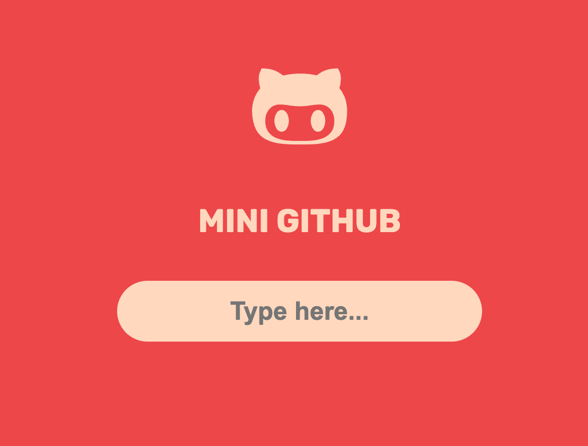
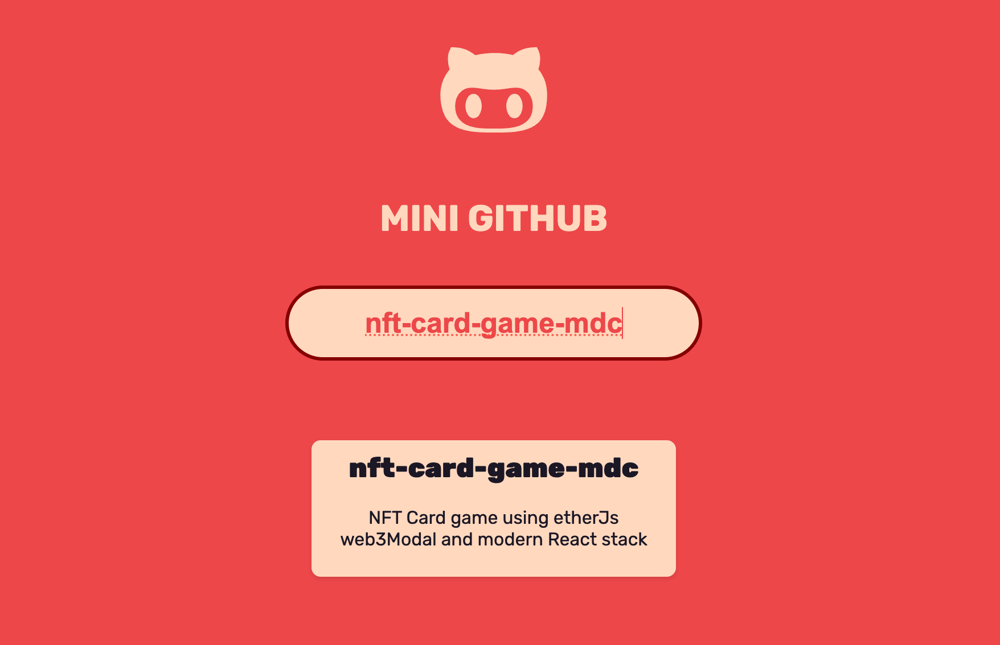
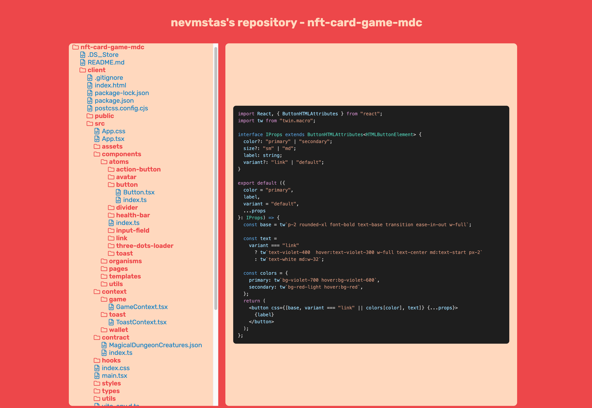

# Mini Github App for Educational Purposes

This is a Next.js project utilizing React, Sass for styling, and GraphQL for interfacing with the GitHub API.

## Technology Stack

- Next.js v14
- React
- Sass
- GraphQL

I opted for Next.js due to React's recommendation for standard application initialization, and I specifically chose version 14 to delve deeper into its features.<br/>
Additionally, I intentionally minimized the use of external libraries to gain a comprehensive understanding of React and similar technologies at a fundamental level.

## Getting Started

1. **Create a GitHub Token:**

   - Follow the [GitHub documentation](https://docs.github.com/en/enterprise-server@3.6/authentication/keeping-your-account-and-data-secure/managing-your-personal-access-tokens) to create a personal access token.

2. **Create `env.local` File:**
   - In the root of the project, create a file named `.env.local`.
   - Add the following variables, replacing `your_token` with your GitHub token and `github_graphql_url` with the GitHub GraphQL URL obtained from the [GitHub documentation](https://docs.github.com/en/graphql/guides/forming-calls-with-graphql#the-graphql-endpoint).

```bash
  NEXT_PUBLIC_GITHUB_TOKEN=your_token
  NEXT_PUBLIC_GITHUB_GRAPHQL_URL=github_graphql_url
```

```bash
npm install
npm run dev
```

Plans

- Implement "Load more repositories" logic.
- Enhance user experience for repository tree navigation (e.g., selecting files/folders, optimizing for mobile devices).
- Introduce testing.

Type the name of the repository.
<br />

<br />
Browse and click on folders/files.
<br />

<br />
Explore the code.
<br />

